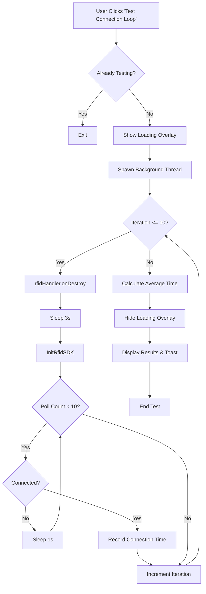

# TC22R, EM45, eConnex: Test Connect RFID Sample (v1.0.0)

## Overview
The "Test Connection Loop" (Stress Test) is a diagnostic feature used to benchmark the reliability and speed of the automated connection process between the Zebra mobile computer and the RFID sled. Written in Kotlin, it leverages `RFIDHandler`'s lifecycle-aware architecture to ensure robust state management under repeated stress.

## Execution Flow

### 1. Initialization
- **Trigger**: User selects `R.id.TestConnectDisconectLoop` from the options menu in `MainActivity`.
- **State Guard**: Checks `bTesting` flag to prevent concurrent test runs.
- **UI Feedback**: Displays a `loadingOverlay` with real-time status updates (e.g., "Iteration 1 / 10") using `runOnUiThread`.

### 2. The Test Cycle (10 Iterations)
The test runs on a background `Thread` to maintain UI responsiveness.

1.  **Cleanup**: Calls `rfidHandler.onDestroy(silent = true)` to dispose of current SDK resources and shut down the internal executor.
2.  **Settle Time**: Sleeps for **3 seconds** to allow the Android USB subsystem and the RFID service to stabilize.
3.  **Re-Initialization**: Calls `InitRfidSDK()`, which:
    - Creates a new instance of `RFIDHandler`.
    - Automatically registers the `DefaultLifecycleObserver` on the Main Thread.
    - Re-initializes the `SingleThreadExecutor` for background SDK tasks.
4.  **Connection Polling**: Enters a secondary loop for up to **10 seconds**:
    - Periodically checks `rfidHandler.isReaderConnected()` every second.
    - Once connected, retrieves `lAPIConnectTime` (the duration of the `reader.connect()` call).
5.  **Data Collection**: Accumulates successful connection times for final statistical analysis.

### 3. Finalization
- **Calculation**: Computes the average connection time (ms) across all successful iterations.
- **UI Update**: 
    - Updates `textRFIDStatusLabel` with the benchmark result: `Avg Connect Time: {X}ms`.
    - Shows a `Toast` indicating the test is complete.
    - Dismisses the `loadingOverlay`.
- **Reset**: Sets `bTesting = false`.

## Threading & Safety

- **Background Execution**: The test logic is isolated from the Main Thread to avoid ANRs.
- **Internal Concurrency**: `RFIDHandler` internally manages SDK calls via a `SingleThreadExecutor`, ensuring sequential processing of connection requests.
- **UI Marshalling**: All updates to `TextView`s, `Button` states, and `Overlay` visibility are safely dispatched to the UI thread.
- **Kotlin Features**: Uses Kotlin property accessors and null-safe calls for cleaner and safer resource management.

---

## Flowchart (Visual)

## Flowchart (Mermaid)

