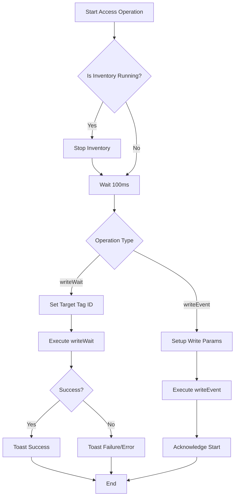
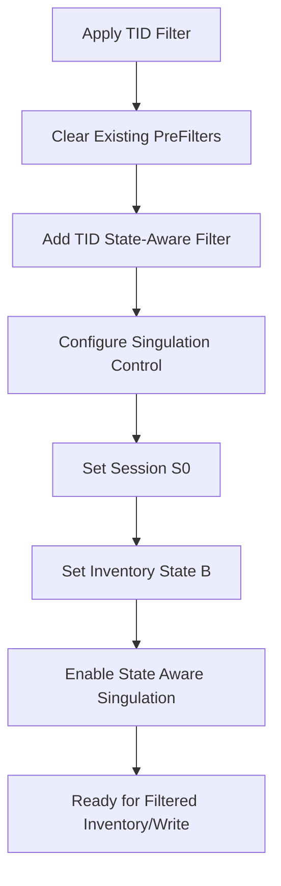

# RFID Access Operations Design Doc

This document outlines the design and implementation of RFID tag access operations (Read/Write) using the Zebra RFID SDK, focusing on `writeWait`, `writeEvent`, and Pre-filtering.

## 1. Code Review & Observations

### writeWait (Synchronous Write)
- **Usage**: Used in `write(selectTagID, ...)` for targeted operations.
- **Mechanism**: Blocks until the operation completes or times out.
- **Benefit**: Immediate feedback on whether the specific tag was successfully written.
- **Current implementation**: Correctly stops inventory before starting access operation, which is a requirement for many RFID readers.

### writeEvent (Asynchronous Write)
- **Usage**: Used in `resetPC(...)` for bulk or filter-based operations.
- **Mechanism**: Non-blocking. The operation is queued and executed by the reader.
- **Benefit**: Can be used to write to multiple tags matching a filter without knowing their specific IDs beforehand in a "wait" loop.
- **Observation**: In `resetPC`, it targets `MEMORY_BANK_EPC` with offset 0 to reset the Protocol Control (PC) bits.

### Pre-filtering (State-Aware)
- **Mechanism**: Uses `FILTER_ACTION_STATE_AWARE` to move matching tags to a specific session state (e.g., Session S0, State B).
- **Singulation**: Complemented by `setSingulationForFilter` which configures the reader to only "see" tags in State B.
- **Advantage**: Extremely efficient for isolating a specific tag (like a TID-based filter) in a dense environment before performing write operations.

---

## 2. API Usage Snippets

### A. Targeted Write (`writeWait`)
Used when you have a specific Tag ID (EPC) and want to write data to it.

```kotlin
val tagAccess = TagAccess()
val writeAccessParams = tagAccess.WriteAccessParams().apply {
    accessPassword = 0
    memoryBank = MEMORY_BANK.MEMORY_BANK_USER
    offset = 0
    setWriteData("12345678")
    writeDataLength = 2 // 4 bytes = 2 words
}

try {
    reader.Actions.TagAccess.writeWait(targetTagID, writeAccessParams, null, tagData)
    // Success
} catch (e: Exception) {
    // Handle failure
}
```

### B. Bulk/Filtered Write (`writeEvent`)
Used for operations like "Reset all matching tags" or when the Tag ID is handled by a filter.

```kotlin
val writeAccessParams = tagAccess.WriteAccessParams().apply {
    memoryBank = MEMORY_BANK.MEMORY_BANK_EPC
    offset = 0
    setWriteData("3000") // Reset PC to 3000
    writeDataLength = 1
}

// Applies to tags matching the current filter/inventory criteria
reader.Actions.TagAccess.writeEvent(writeAccessParams, null, null)
```

### C. Setting TID Pre-filter
Used to isolate a tag by its unique TID.

```kotlin
val filter = PreFilters().PreFilter().apply {
    setAntennaID(1)
    setMemoryBank(MEMORY_BANK.MEMORY_BANK_TID)
    setTagPattern(tidString)
    setTagPatternBitCount(tidString.length * 4)
    setBitOffset(0)
    setFilterAction(FILTER_ACTION.FILTER_ACTION_STATE_AWARE)
    StateAwareAction.setTarget(TARGET.TARGET_INVENTORIED_STATE_S0)
    StateAwareAction.setStateAwareAction(STATE_AWARE_ACTION.STATE_AWARE_ACTION_INV_B_NOT_INV_A)
}

reader.Actions.PreFilters.deleteAll()
reader.Actions.PreFilters.add(filter)
```

---

## 3. Access Operation Flowchart



---

## 4. State-Aware Filtering Flow


