# RFID SDK Lifecycle & Connection Design (v1.0.0)

This document describes the design for initializing, connecting, and disconnecting the Zebra RFID SDK within the AutoConnect RFID application, written in Kotlin.

## 1. SDK Initialization

Initialization is managed through `RFIDHandler.kt`, which acts as a lifecycle-aware controller.

### Entry Point — `InitRfidSDK()` (MainActivity)
`InitRfidSDK()` is the top-level factory method called from `MainActivity`. It always tears down any existing handler before creating a new one:
1. Calls `rfidHandler?.onDestroy()` and sets `rfidHandler = null`.
2. Instantiates a fresh `RFIDHandler`.
3. Calls `rfidHandler?.onCreate(this)` to wire up the activity context.

### `RFIDHandler.onCreate(activity)`
1. Stores the `MainActivity` reference and the `statusTextViewRFID` `TextView`.
2. Registers itself as a `DefaultLifecycleObserver` on the UI thread via `activity.lifecycle.addObserver(this)`.
3. Calls `initSDK()`.

### `RFIDHandler.initSDK()`
- Guarded by `@Volatile bInit` and `@Synchronized` to prevent double-initialization.
- Re-creates a shut-down `SingleThreadExecutor` if needed.
- On the executor background thread:
  - If `readers == null`: calls `createInstance()` (transitions state to `CONNECTING`, waits 1 s for USB subsystem, then creates the `Readers` object with `ENUM_TRANSPORT.ALL` and attaches the event handler).
  - If `readers != null`: calls `connectReader()` directly.

## 2. Connection State Machine

`RFIDHandler` maintains a formal `ConnectionState` enum:

| State | Meaning |
|---|---|
| `DISCONNECTED` | No active reader connection |
| `CONNECTING` | Connection attempt in progress |
| `CONNECTED` | Reader successfully connected |
| `ERROR` | SDK or connection error |

All state transitions go through `updateState(newState)`, which is `@Synchronized` and drives all UI side-effects:
- **`CONNECTING`**: calls `MainActivity.showLoading(msg)`.
- **`CONNECTED`**: calls `beep()`, hides loading overlay, sets `textRFIDStatusLabel` to "RFID Status: Connected", appends latency (`lAPIConnectTime ms`) to the status string.
- **`DISCONNECTED`**: hides loading overlay, sets `textRFIDStatusLabel` to "RFID Status: Disconnected".
- **`ERROR`**: hides loading overlay.

## 3. Connection Logic

### Reader Discovery — `getAvailableReader()`
Queries `readers.GetAvailableRFIDReaderList()`. Selection priority:
- If only one reader is found → use it.
- If multiple readers exist → pick the first whose name contains any of: `-G`, `RFID`, `TC27R`, or `TC22R` (covers eConnex/USB-CIO, EM45RFID, TC53RFID, TC22R, TC27R integrated readers).
- Non-matching readers are skipped and logged.

### `connectReader()`
- `@Synchronized`; double-checked locking: skips if already connected.
- Re-creates a shut-down executor if needed.
- Dispatches a background task that calls `getAvailableReader()` then `connectMethod()`.

### `connectMethod()`
1. Calls `reader.connect()`, timing the call with `System.currentTimeMillis()` → stored in `lAPIConnectTime`.
2. On success calls `configureReader()` then `updateState(CONNECTED)` and shows a toast with latency.

### `configureReader()`
Registers an `EventHandler` and enables:
- `setHandheldEvent(true)` — physical trigger events.
- `setTagReadEvent(true)` — tag read notifications.
- `setAttachTagDataWithReadEvent(false)` — tag data delivered via `getReadTags()` callback only.
- `setReaderDisconnectEvent(true)` — hardware disconnect notifications.

## 4. Disconnection & Cleanup

### `dispose(silent)`
1. Transitions state to `DISCONNECTED`.
2. Calls `reader.disconnect()` if connected (shows "Disconnected" toast unless `silent = true`).
3. Calls `readers.Dispose()` and nulls both `reader` and `readers`.
4. Resets `bInit = false`.

### `onDestroy(silent)` (programmatic)
Calls `dispose(silent)` then `executor.shutdownNow()`.

### `onDestroy(owner)` (lifecycle callback)
Removes the lifecycle observer, then calls `onDestroy(false)`.

## 5. Hardware Event Handling

### SDK-level events (via `Readers.RFIDReaderEventHandler`)
- **`RFIDReaderAppeared`**: plays a beep, shows a toast, calls `connectReader()`.
- **`RFIDReaderDisappeared`**: shows a toast, transitions state to `DISCONNECTED`.

### OS-level USB events (via `BroadcastReceiver` in `MainActivity`)
- **`USB_DEVICE_ATTACHED`**: checks vendor ID against `RFID_VID = 1504`; if matched, calls `InitRfidSDK()`.
- **`USB_DEVICE_DETACHED`**: calls `rfidHandler?.onDestroy()` and nulls the handler.
- **`USB_PERMISSION`**: shows a granted/denied toast.

The receiver is registered only when USB devices are already present at startup (`requestPermission()`), with `RECEIVER_EXPORTED` on Android 14+.

### `DISCONNECTION_EVENT` (inside `EventHandler.eventStatusNotify`)
When the SDK fires a software disconnect notification, the handler explicitly calls `reader.disconnect()` then `updateState(DISCONNECTED)`.

## 6. Lifecycle Awareness

`RFIDHandler` implements `DefaultLifecycleObserver`:
- **`onResume()`**: calls `connectReader()` — ensures the reader is ready whenever the user returns to the app.
- **`onDestroy()`**: removes the observer and triggers full cleanup.

## 7. Threading Model

All blocking SDK calls run on a `SingleThreadExecutor`:
1. Prevents UI hangs (`NetworkOnMainThreadException`).
2. Ensures sequential execution during stress testing and rapid USB events.
3. The executor is re-created after `shutdownNow()` if a new connection is needed (e.g., after stress test cleanup).

All UI mutations are dispatched via `context.runOnUiThread()`.

`beep()` runs on its own short-lived `Thread` (two 200 ms tones, 400 ms apart) to avoid blocking the executor.

## 8. Inventory & Tag Display

- **`performInventory()` / `stopInventory()`**: submitted to the `SingleThreadExecutor`; call `reader.Actions.Inventory.perform/stop()`.
- **`StartInventory` / `StopInventory`** (button callbacks in `MainActivity`): disable/re-enable the `TestButton` and delegate to `rfidHandler`.
- **`handleTriggerPress(pressed)`**: physical trigger press clears the tag list, disables `TestButton`, and starts inventory; release re-enables the button and stops inventory.
- **Tag list**: `TagItem(tagID, count, rssi)` entries backed by a `HashMap<String, TagItem>` for O(1) dedup; rendered via a custom `TagAdapter` into `R.layout.tag_list_item` (three columns: Tag ID, Count, Peak RSSI).
- Tag data is read in batches of 100 via `reader.Actions.getReadTags(100)` inside `EventHandler.eventReadNotify`.

## 9. ResponseHandlerInterface

Defined inside `RFIDHandler`, implemented by `MainActivity`:

```kotlin
interface ResponseHandlerInterface {
    fun handleTagdata(tagData: Array<TagData>)
    fun handleTriggerPress(pressed: Boolean)
    fun barcodeData(valStr: String)
    fun sendToast(valStr: String)
}
```

## 10. Permission Handling

- **Bluetooth** (Android 12+): requests `BLUETOOTH_SCAN` + `BLUETOOTH_CONNECT` at startup; `InitRfidSDK()` is deferred until granted.
- **USB**: managed via the `BroadcastReceiver` described in §5.

---

## Change Log
## 11. Flowcharts

All source files are in `diagrams/` (`.mmd`). PNG renders are alongside each source file.

### 11.1 SDK Initialization

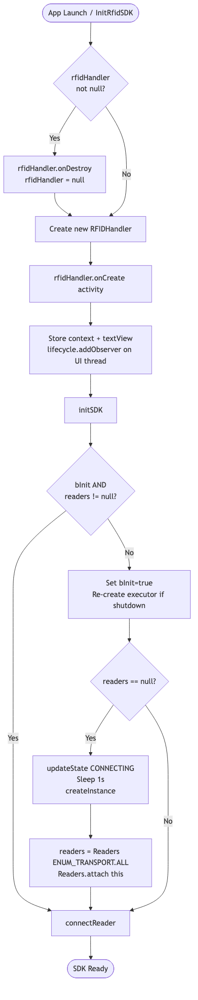

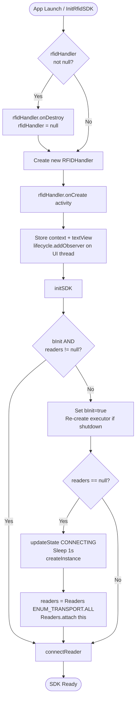

---

### 11.2 Bluetooth Connection

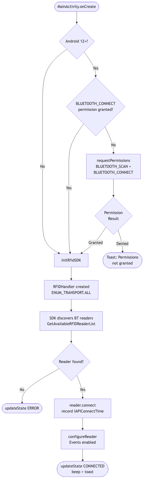

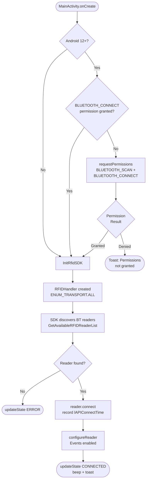

---

### 11.3 USB Connection & Disconnection


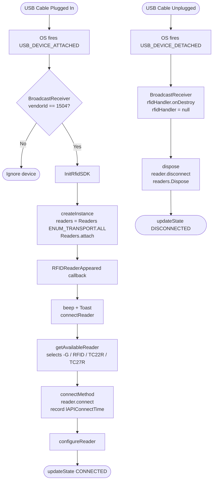

---

### 11.4 Transport Interface Selection


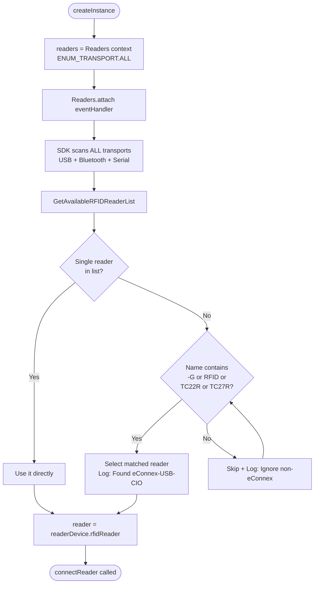

---

### 11.5 getAvailableReader

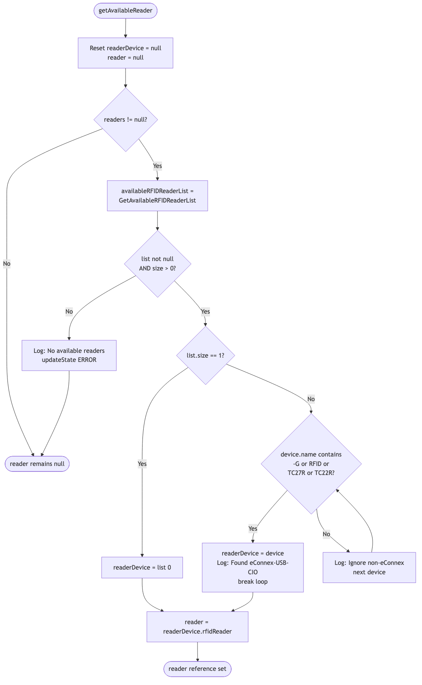

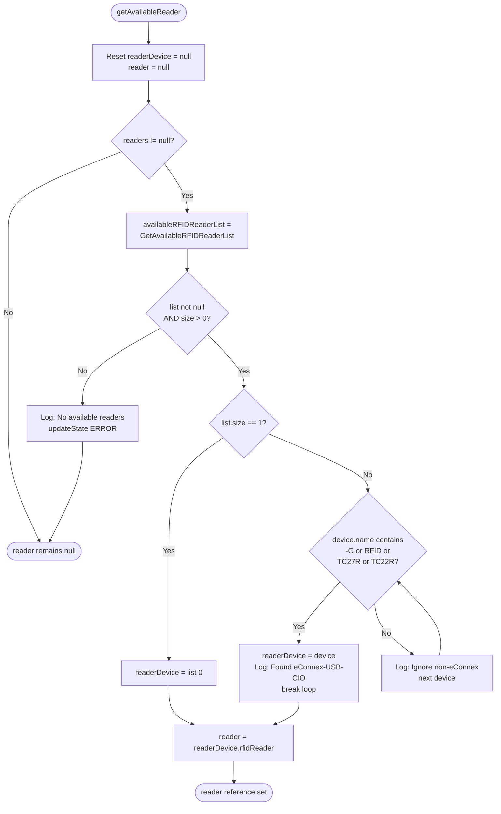

---

### 11.6 Connect

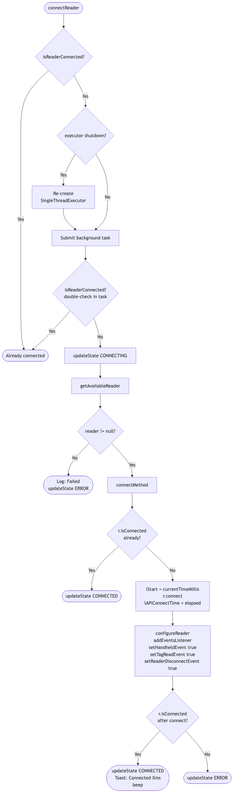

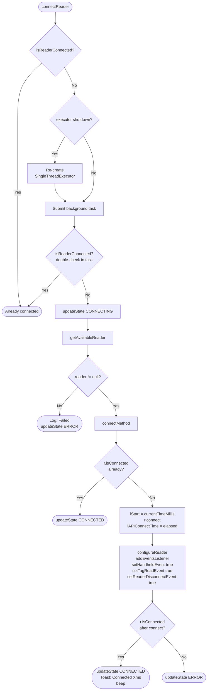

---

### 11.7 Disconnect

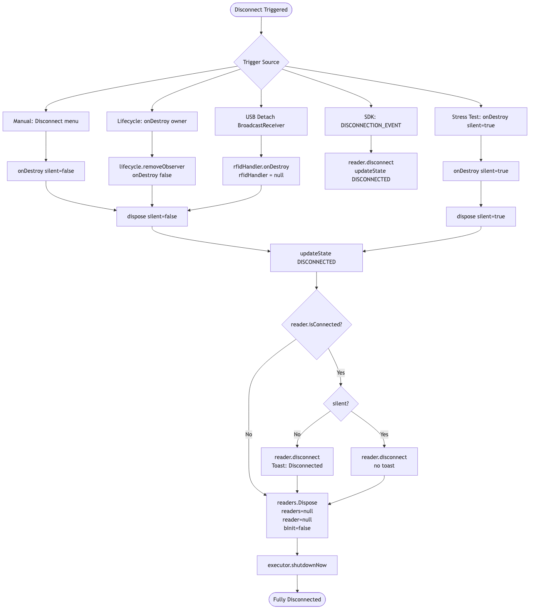

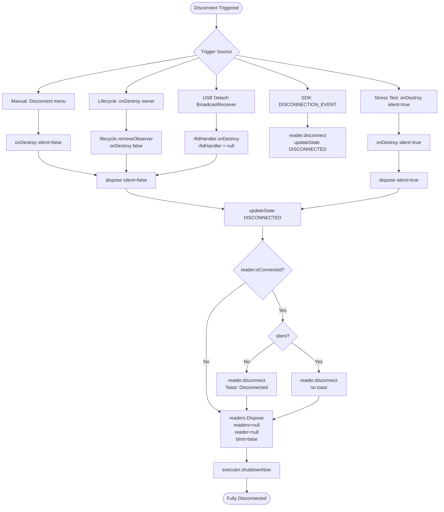

---

### 11.8 Interface Changing

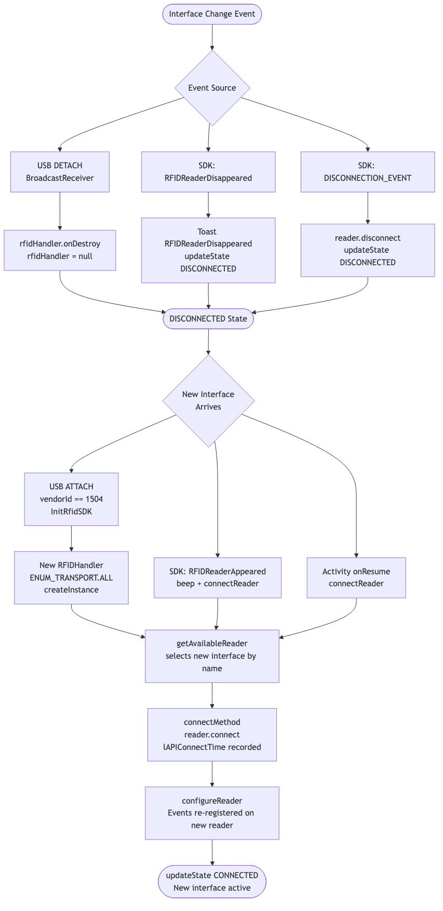

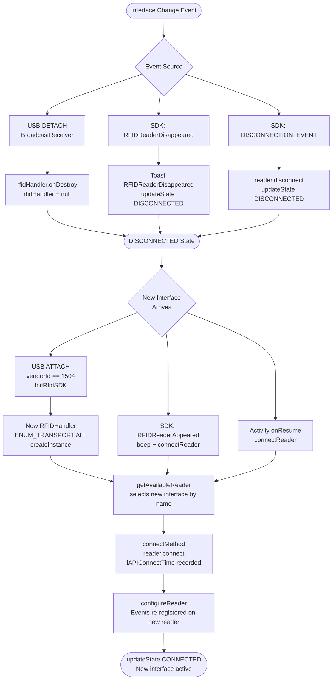

---

## Change Log

### v1.0.0
- Added `build_run.sh` for automated clean/build/install/launch workflow.
- Formalized `ConnectionState` enum and centralized `updateState()` state machine.
- Expanded reader selection to include `RFID`, `TC27R`, `TC22R` device name patterns.
- Added OS-level USB `BroadcastReceiver` for `ATTACHED`/`DETACHED` events (vendor ID `1504`).
- `configureReader()` now enables `setReaderDisconnectEvent(true)` and disables `setAttachTagDataWithReadEvent`.
- `showLoading()` / `hideLoading()` overlay managed by `updateState()`.
- Tag list backed by `HashMap` for dedup; custom `TagAdapter` with three-column layout.
- `InitRfidSDK()` always tears down existing handler before creating a new one.

### v0.1.0
- Written in Kotlin 1.8.20.
- Implemented Reactive UI: "START" button auto-disables during inventory.
- Fixed UI synchronization: Primary "RFID Status" label now correctly syncs with detailed connection status.
- Added explicit `DISCONNECTION_EVENT` handling.
- Optimized threading with `SingleThreadExecutor`.

### v0.0.2
- Enhanced UI to show individual connection time in milliseconds.
- Switched to `ENUM_TRANSPORT.ALL` for better hardware compatibility.
- Improved reader selection logic to prefer eConnex interfaces.

### v0.0.1
- Fixed thread safety crash in stress test loop (Lifecycle observer registration).
- Added comprehensive documentation for the connection test logic.

### v0.0.0
- Initial release of the Auto-Connect sample.
- Added Stress Test Loop for connection benchmarking.
- Implemented `DefaultLifecycleObserver` for SDK management.
- Migrated all blocking operations to `ExecutorService`.

---
